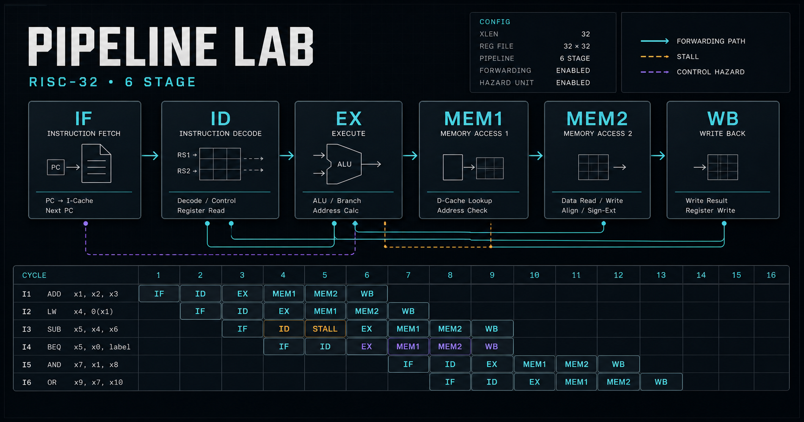

# Pipeline Lab

Pipeline Lab is a browser-based, cycle-accurate laboratory for a small 32-bit RISC processor. The architectural and microarchitectural source of truth is a C++20 core compiled both natively and to WebAssembly. React renders the serialized core state; it does not reimplement CPU behavior.



## What's new in 1.1

- Save portable project files, restore private browser drafts, and export complete execution traces.
- Work through four guided labs with live checkpoints and searchable ISA documentation.
- Compare forwarding and branch-prediction configurations using independent C++ WebAssembly runs.
- Diagnose incorrect manual schedules against the non-pipelined C++ reference interpreter.
- Use keyboard shortcuts, accessible dialogs/tabs, reduced-motion support, and readable display densities.

See the [1.1 release notes](docs/release-notes-1.1.md) for shortcuts, compatibility, and the complete change list.

## What is implemented

- Exactly six stages: **IF → ID → EX → MEM1 → MEM2 → WB**.
- Explicit IF/ID, ID/EX, EX/MEM1, MEM1/MEM2, and MEM2/WB records.
- Two-pass assembler with labels, comments, signed decimal/hex literals, source mapping, pseudoinstructions, and line-specific errors.
- Full ISA, non-pipelined reference interpreter, dynamic instruction IDs, deterministic replay, and 500-cycle undo.
- Full forwarding, no-forwarding interlocks, and intentionally unsafe manual scheduling mode.
- EX-resolved control flow with always-taken, always-not-taken, one-bit, and two-bit predictors.
- Optional set-associative LRU, write-back, write-allocate data cache with configurable timing in the C++ API.
- Structured C++ events for stalls, bubbles, forwarding, cache misses, flushes, writes, faults, predictor updates, and HALT.
- Assembly editor with highlighting, breakpoint/current-PC gutter, six-stage cards, timeline, datapath, state inspectors, event explanations, configuration controls, and 12 teaching examples.
- Versioned project import/export, browser-local drafts, and complete JSON execution traces.
- Guided checkpoint labs, searchable ISA help, C++ reference-result diagnostics, and side-by-side configuration comparisons.
- Keyboard navigation, visible focus, reduced-motion handling, accessible tabs/dialogs, and comfortable/compact display densities.

## Architecture

```text
Assembly source ──> C++ assembler ──> instruction memory
                                           │
React controls ──JSON/Embind──> C++ six-stage engine
       ▲                                   │
       └──── state / events / timeline ────┘
```

The native and WebAssembly builds compile `core/src/core.cpp`. TypeScript only owns presentation, timers, and user interaction. See [architecture.md](docs/architecture.md), [isa.md](docs/isa.md), [pipeline-semantics.md](docs/pipeline-semantics.md), [browser support](docs/browser-support.md), and the [1.1 release notes](docs/release-notes-1.1.md).

## Quick start

Requirements: Node.js 22+, CMake 3.20+, a C++20 compiler, and Emscripten 6.0.2 for rebuilding WebAssembly. A verified, content-addressed WebAssembly artifact is committed under `frontend/src/generated`, so the app starts after the frontend install. Vite owns both the JavaScript loader and `.wasm` URL; nothing imports mutable files from `public`.

```bash
npm ci
npm run dev
```

Open `http://localhost:3000`.

## Builds and tests

Native core:

```bash
cmake -S . -B out/build
cmake --build out/build --config Release
ctest --test-dir out/build -C Release --output-on-failure
```

WebAssembly (after activating Emscripten):

```bash
npm run wasm
```

Frontend production build and integration tests:

```bash
npm run build
npm test
```

Runtime server QA (including real asset and MIME checks):

```bash
npm run qa:dev
npm run qa:prod
```

`qa:dev` also republishes the staged WebAssembly build while the server is running, which guards against the Windows file-lock regression. `qa:prod` tests the Cloudflare-compatible production output through Wrangler; `vinext start` is not used as the production acceptance server. See [qa.md](docs/qa.md) for the complete test matrix and interactive acceptance checklist.

`npm run test:all` coordinates native and frontend checks when CMake and Emscripten are already on `PATH`. On Windows, the repository was verified with Visual Studio Build Tools 2022 and the CMake bundled with it.

The native CLI accepts one assembly file and prints final state JSON:

```bash
out/build/Release/cpulab_cli examples/programs/counted-loop.asm
```

## Pipeline model in one page

- Each call to `stepCycle()` computes next state from current state, then commits latches and architectural state together.
- The register file is write-first within a cycle: WB commits before the instruction in ID samples its operands.
- Integer ALU values can forward from EX/MEM1, MEM1/MEM2, or MEM2/WB.
- Loads access memory through MEM1 and complete in MEM2. A consumer immediately behind a load receives one bubble with full forwarding and uses the MEM1/MEM2-to-EX path in the following cycle.
- Branches resolve in EX. A wrong direction or target squashes the younger ID and IF instructions. Squashed side effects never reach memory or writeback.
- HALT stops new fetch when decoded and retires only after all older instructions complete.
- NOP is a real retired instruction; an inserted bubble and a flushed instruction are not retired.

## ISA overview

| Group | Instructions |
|---|---|
| Arithmetic | `ADD SUB MUL ADDI` |
| Logic/shift | `AND OR XOR SLL SRL` |
| Compare | `SLT` |
| Memory | `LW SW` |
| Control | `BEQ BNE BLT J JAL JR` |
| Utility | `LUI NOP HALT` |
| Pseudo | `LI MOV B RET` |

All instructions are fixed 32-bit little-endian words. See [isa.md](docs/isa.md) for the opcode table, bit layouts, ranges, and expansion rules.

## Statistics semantics

- `fetched` counts every dynamically fetched word, including later-squashed words.
- `retired` includes architectural instructions, `NOP`, and `HALT`; it excludes bubbles and squashes.
- CPI is cycles / retired and IPC is retired / cycles.
- control penalty counts flushed younger instructions; cache and dependency waits have separate stall counters.
- useful utilization is the UI's retired-instruction estimate divided by six stage-slots per cycle, not a hardware power metric.

## Error behavior

Assembly failure preserves the error list and does not execute partial output. Runtime checks stop deterministically on invalid opcodes, unaligned fetch/load/store, out-of-range memory, or the configured cycle limit. The frontend reports WebAssembly initialization failure and never falls back to a TypeScript CPU.

## Repository map

```text
core/                 C++ ISA, assembler, pipeline, predictor, cache, reference model
core/tests/           Native deterministic regression suite
frontend/src/         React laboratory, types, examples, WASM adapter, styling
frontend/src/generated Content-addressed, Vite-managed WebAssembly artifacts
examples/programs/    Standalone assembly programs
docs/                 Architecture and timing specifications
tests/                Frontend structure and WebAssembly integration tests
```

## Known limitations

- Cache geometry and timing are configurable in the C++ configuration object; the current UI exposes the validated default geometry and an enable switch rather than every numeric cache field.
- Undo retains 500 pre-cycle snapshots. Long timeline history remains visible for the current run, while the UI renders the most recent 40 dynamic instructions and 28 cycles at once.
- Memory edits are byte/word oriented; there is no file import/export yet.
- The optional datapath is an educational block diagram, not an RTL schematic.
